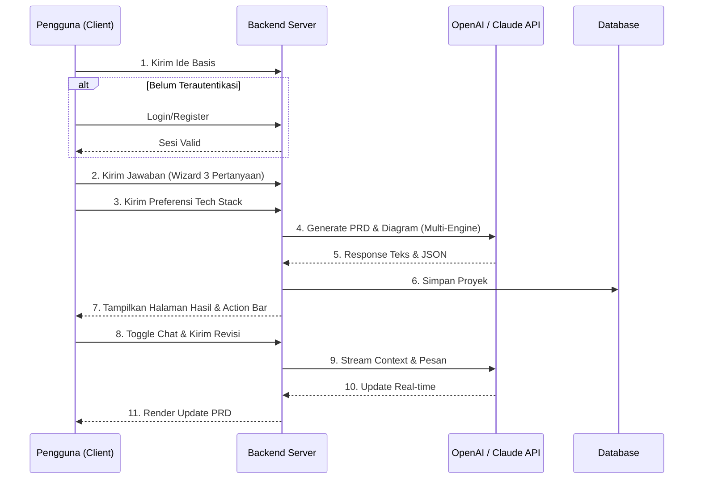

# PRD — Project Requirements Document

## 1. Overview
**SpecFlow** adalah platform pembuat spesifikasi pengembangan (*development specs*). Tujuan utamanya adalah **membantu AI Developer, Vibe Coder, dan Founder menghasilkan dokumen PRD (Project Requirements Document) yang komprehensif, terstruktur, dan siap digunakan oleh AI Coding Tools dalam waktu kurang dari 10 menit.** Sistem mendukung iterasi detail via agen chat AI, manajemen riwayat proyek melalui dashboard, serta ekspor format yang dioptimalkan khusus untuk konteks AI developer.

## 2. Requirements
Persyaratan utama dari proyek ini didasarkan pada kebutuhan masing-masing tipe pengguna dan standar keamanan produk MVP:
*   **Sebagai AI Developer:** Harus dapat memasukkan ide aplikasi, mendapatkan PRD lengkap, dan mengekspornya dalam format Markdown (`.md`) yang terstruktur secara hierarkis agar siap langsung disalin ke *context window* AI Coding Tools (Cursor/Windsurf).
*   **Sebagai Vibe Coder:** Harus mendapatkan *user flow* berbentuk diagram visual (Mermaid.js) untuk memahami arsitektur navigasi, serta memiliki akses ke *Interactive AI Agent* untuk mengajukan pertanyaan lanjutan atau merevisi spesifik secara iteratif.
*   **Sebagai Founder:** Harus mendapatkan rekomendasi teknologi (*tech stack*) otomatis, serta *Dashboard Proyek* untuk menyimpan, membandingkan, dan mengelola beberapa ide/aplikasi yang sedang dalam tahap perencanaan.
*   **Sistem & Keamanan (Authentication Flow):** Mendukung alur autentikasi lengkap (Register, Login, Password Recovery) menggunakan mekanisme sesi yang aman (JWT/secure cookies) melalui Better Auth.
*   **Sistem AI & Interaksi:** Mampu memproses input menggunakan kecerdasan buatan dari OpenAI API (GPT-4o) dan Claude API (Claude 3.5 Sonnet) untuk menghasilkan dokumen, diagram, dan sesi *chat streaming* secara *real-time*.

## 3. Core Features
1.  **Input Ide Bahasa Natural:** Kolom teks sederhana untuk menuangkan ide kasar secara bebas.
2.  **Validasi Konteks Interaktif:** Sistem menanyakan 3 pertanyaan krusial (Siapa user-nya? Seberapa parah masalahnya? Bagaimana solusi saat ini?) untuk memperdalam konteks AI.
3.  **Pemilihan Preferensi Teknologi Terpandu:** Opsi *Otomatis* (AI memilih framework modern) atau *Manual* (pengguna memilih dari dropdown).
4.  **Generator Teks & Visual Alur Kerja:** Mengubah ide menjadi PRD Markdown dan diagram arsitektur navigasi otomatis menggunakan *Mermaid.js*.
5.  **Multi-AI Engine:** Gabungan OpenAI (GPT-4o) untuk struktur data dan Anthropic (Claude 3.5 Sonnet) untuk logika dokumentasi teknis yang kompleks.
6.  **Interactive AI Specification Agent:** Panel *chat* di sisi kanan layar untuk meminta revisi, menambah detail teknis, atau mengubah alur secara natural.
7.  **Ekspor Markdown Teroptimasi & Kontrol Dokumen:** *Action bar* atas menyediakan:
    *   *Toggle Preview/Edit:* Berpindah antara render Markdown rapi dan editor teks.
    *   *Tombol Download & Copy:* Ekspor cepat ke file `.md` atau clipboard.
    *   *Tombol Chat Agent:* Saklar toggle untuk menampilkan/menyembunyikan panel chat AI.
8.  **Dashboard Proyek (Project History):** Halaman untuk mengelola, membuka kembali, atau mengekspor ulang PRD yang pernah dibuat.
9.  **Push Notifications (Opsional):** Notifikasi status progres generate PRD atau pembaruan platform.

## 4. User Flow
1.  **Input Ide:** Pengguna menulis ide di halaman utama **SpecFlow**.
2.  **Autentikasi:** Login/Register (jika belum) untuk menyimpan progres.
3.  **Step-by-Step Wizard:** Menjawab 3 pertanyaan validasi konteks satu per satu.
4.  **Tech Stack Selection:** Memilih preferensi teknologi (Auto/Manual).
5.  **Generation Process:** AI memproses data dengan indikator progres visual.
6.  **Hasil & Iterasi:** Pengguna masuk ke halaman hasil, melihat PRD/Diagram, dan menggunakan AI Agent di panel samping untuk revisi jika diperlukan.
7.  **Ekspor:** Menyalin atau mengunduh output Markdown ke alat coding AI.
8.  **Management:** Mengelola riwayat di Dashboard Proyek.

## 5. Architecture
**SpecFlow** menggunakan arsitektur *Client-Server* dengan Next.js. Backend menangani logika bisnis, database, dan *streaming response* dari AI APIs.

## 6. Database Schema
*   **Users**: `id`, `name`, `email`, `password_hash`, `created_at`, `subscription_tier`.
*   **Projects**: `id`, `user_id`, `initial_idea`, `answers (JSON)`, `tech_stack`, `generated_prd`, `status`.
*   **ProjectMessages**: `id`, `project_id`, `role (user/assistant)`, `content`, `created_at`.
*   **UsageQuotas**: `id`, `user_id`, `month`, `prd_count`, `chat_count`.

## 7. Tech Stack
*   **Frontend:** Next.js, Tailwind CSS, shadcn/ui.
*   **Rendering:** Mermaid.js, react-markdown.
*   **Database:** SQLite dengan Drizzle ORM.
*   **Auth:** Better Auth.
*   **AI:** OpenAI SDK (GPT-4o) & Anthropic SDK (Claude 3.5 Sonnet).
*   **Billing:** Stripe / Midtrans (untuk manajemen subscription & webhook).

## 8. UI/UX Design Guidelines
**SpecFlow** mengikuti filosofi desain **"Focus-Driven Workflow"** untuk meminimalkan gangguan bagi pengguna.

*   **Aestetik Modern SaaS Minimalis:** Menggunakan **shadcn/ui** sebagai basis komponen. Palet warna netral (clean whites, deep slates) dengan tipografi yang tajam untuk memastikan keterbacaan dokumen teknis yang maksimal.
*   **Step-by-Step Wizard Input:** Alur input pertanyaan validasi tidak ditampilkan dalam satu formulir panjang, melainkan melalui *wizard* bertahap. Hal ini mengurangi *cognitive load* dan memastikan pengguna memberikan jawaban berkualitas pada setiap tahapan konteks.
*   **Split-Screen Layout (Halaman Hasil):**
    *   **Area Utama (Kiri/Tengah):** Fokus pada dokumen PRD dan Diagram Mermaid.
    *   **Collapsible Right Panel:** Panel AI Agent yang bisa digeser atau disembunyikan sepenuhnya.
*   **Interactive Action Bar:** Bar navigasi statis di bagian atas area kerja yang berisi kontrol krusial:
    *   *Segmented Control (Toggle):* Tombol geser untuk berpindah antara mode "Preview" (tampilan spek rapi) dan "Edit" (raw markdown).
    *   *Utility Buttons:* Ikon Download dan Copy yang diletakkan secara ergonomis untuk akses cepat.
    *   *Agent Toggle:* Tombol visual untuk memicu animasi masuk/keluar panel chat AI Agent.
*   **Feedback Visual:** Penggunaan skeleton screens selama proses generasi AI dan notifikasi toast yang halus untuk konfirmasi aksi (contoh: "Copied to clipboard").
*   **Paywall & Tier Indicator:** Indikator status tier (Freemium/Starter/Pro) yang terlihat jelas di navbar, beserta modal upgrade yang muncul otomatis saat pengguna mencapai batas kuota atau mencoba fitur premium.

## 9. Rekomendasi Prioritas MVP
Urutan pengembangan diprioritaskan untuk membangun fungsionalitas inti dengan desain intuitif:

1.  **Core Generation & UI Wizard:** Implementasi input ide, 3 pertanyaan validasi, dan integrasi awal AI untuk menghasilkan teks PRD.
2.  **UI/UX Halaman Hasil (Split-Screen):** Membangun layout utama hasil, termasuk Action Bar dengan toggle Preview/Edit serta rendering Markdown dan Mermaid.js.
3.  **Auth Flow & Dashboard:** Implementasi sistem login/register dan halaman riwayat proyek untuk persistensi data.
4.  **Interactive AI Agent:** Pengembangan panel chat kanan yang collapsible dan fitur revisi dokumen secara real-time via streaming API.
5.  **Sistem Kuota, Monetisasi & Final Polishing:** Implementasi manajemen tier akses (Freemium, Starter, Pro) berbasis kuota generate dan chat, integrasi gateway pembayaran, serta verifikasi otomatis *unlock* fitur premium sesuai langganan. Optimasi format ekspor .md untuk tools seperti Cursor/Windsurf serta persiapan infrastruktur pembayaran (Stripe/Midtrans).

## 10. Strategi Monetisasi
Model bisnis akan mengadopsi struktur tiered SaaS dengan batasan kuota dan fitur yang jelas untuk mendorong konversi dan menjamin keberlanjutan operasional:

1.  **Freemium (Akses Dasar)**
    *   **Kuota:** 1 kali percobaan pembuatan PRD per bulan.
    *   **AI Engine:** Model standar (GPT-4o mini).
    *   **Fitur:** Akses terbatas hanya pada tahap eksplorasi ide dan validasi konteks (wizard). Alur sistem akan berhenti tepat sebelum tahap final generate PRD. Tidak termasuk diagram visual, fitur export lanjutan, maupun akses ke Interactive AI Agent. Cocok untuk evaluasi awal produk.

2.  **Starter (Berlangganan Bulanan)**
    *   **Kuota:** Maksimal 5 PRD per bulan.
    *   **Interaksi AI:** 100 pesan chat/revisi per bulan melalui Interactive AI Agent.
    *   **AI Engine:** Akses penuh ke model high-end (Claude 3.5 Sonnet & GPT-4o) untuk arsitektur yang lebih tajam dan kompleks.
    *   **Fitur Premium:** Export diagram Mermaid.js ke format gambar (.png/.svg), PDF, dan Markdown.
    *   **Manajemen:** Advanced Repository dengan penyimpanan riwayat proyek permanen dan fitur perbandingan antar-project di dashboard.

3.  **Pro (Berlangganan Bulanan)**
    *   **Model Berlangganan:** Paket Pro menggunakan skema berlangganan bulanan. Pengguna mendapatkan akses penuh selama periode berlangganan berjalan.
    *   **Kuota & Akses:** Tanpa batas (*Unrestricted/Unlimited*) untuk generasi PRD dan revisi chat melalui Interactive AI Agent selama masa aktif berlangganan.
    *   **Kebijakan Berakhir:** Setelah periode 1 bulan berakhir, akses untuk melakukan generate atau merevisi PRD akan otomatis ditutup/dinonaktifkan hingga pengguna memperbarui langganan. Riwayat proyek tetap tersimpan, tetapi fungsi pembuatan dokumen baru dibekukan.
    *   **AI Engine & Fitur Premium:** Akses penuh ke model high-end (Claude 3.5 Sonnet & GPT-4o) dengan prioritas antrian pemrosesan (*low latency*). Seluruh fitur Starter disertakan, termasuk export lanjutan, penyimpanan history tanpa batas, dan dukungan teknis prioritas. Paket ini dirancang sebagai arus kas utama (MRR) dengan memberikan fleksibilitas maksimal bagi power user.